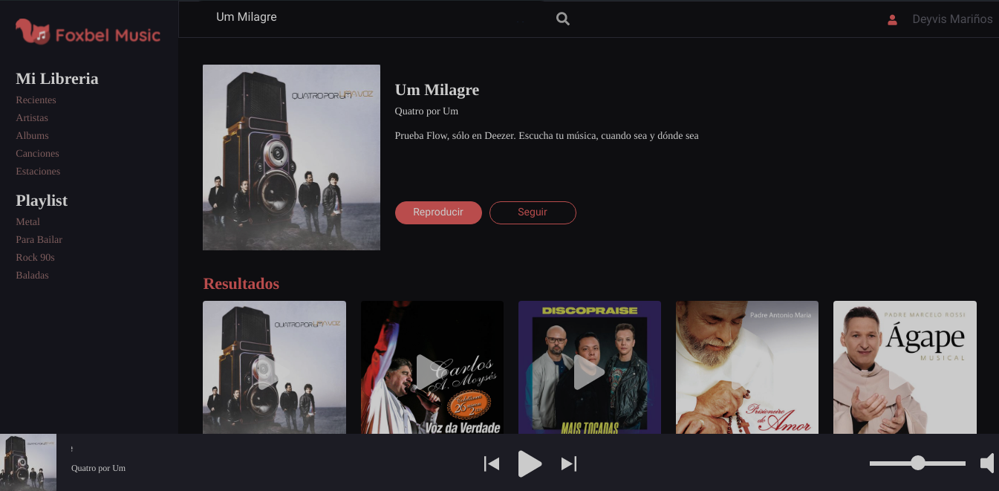

# Reto Deezer

Web application created to apply as a Frontend developer
# Screenshots

# Tools
- [React](https://reactjs.org/) - Framework
- [Sass](https://sass-lang.com/) - CSS preprocessor
- [Github Pages](https://pages.github.com/) - Hosting and deployment
- [Api Deezer](https://developers.deezer.com/) - Api

# Deployment
- The application is deployed in [GitHub Pages](https://pages.github.com/) in this [link](https://deyvis17gy.github.io/reto-deezer/)

# Ejecutar de manera local
1. Clone this repository [reto-deezer](https://github.com/Deyvis17GY/reto-deezer.git)
2. In the project directory, you can run: 
### `yarn install`
Runs the app in the development mode.\
Open [http://localhost:3000](http://localhost:3000) to view it in the browser.
### `yarn start`

Runs the app in the development mode.\
Open [http://localhost:3000](http://localhost:3000) to view it in the browser.

The page will reload if you make edits.\
You will also see any lint errors in the console.
### `yarn build`

Builds the app for production to the `build` folder.\
It correctly bundles React in production mode and optimizes the build for the best performance.

The build is minified and the filenames include the hashes.\
Your app is ready to be deployed!